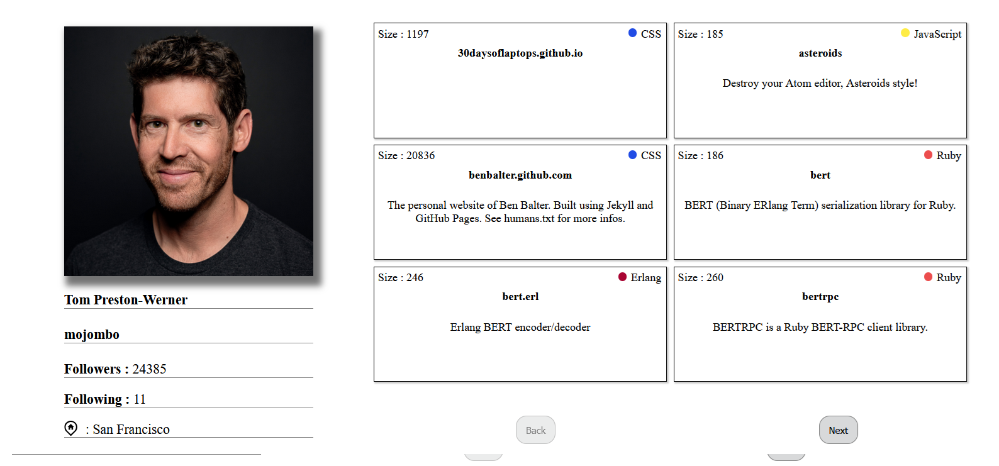

# GitHub User Explorer

This is a React application that allows users to search for GitHub profiles, view basic user information, repositories, and organizations. This project is primarily a learning and experimental project, so it’s not fully polished.

⚠️ **Note:** This application requires a GitHub personal access token to function. Without it, fetching user data and repositories will not work. The token should be stored in a `.env` file in the root of your project.

---

## Table of Contents

- [Features](#features)
- [Setup](#setup)
- [Usage](#usage)
- [Screenshots](#screenshots)
- [License](#license)

---

### Features

- Search GitHub users by username
- Display user information: avatar, name, login, followers, following, location
- Display user repositories with language and size
- Pagination for repositories
- Color-coded repository languages
- Simple and responsive UI

---

### Setup

1. Clone the repository:

```bash
git clone https://github.com/your-username/github-user-explorer.git
```
2. Navigate into the project folder:
```bash
cd my-app
```
3. Create a .env file in the root of the project:
```bash
REACT_APP_GITHUB_TOKEN=your_personal_access_token_here
```
4. Install Dependencies
```bash
npm install
```
5. Start the development server:
```bash
npm start
```
The app should now be running at http://localhost:3000.

## **Search Example**


## **User Info View**  

